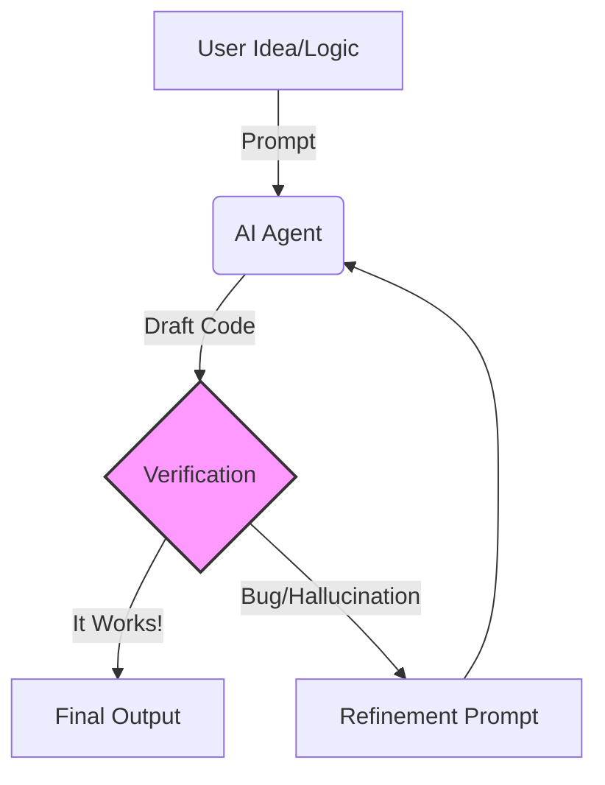

::::::::::::::::::::::::::::::::::::::: objectives

## Objectives

- Compare CLI and browser-based AI tools.
- Create a project context file.
- Explain the shift from writer to editor.

::::::::::::::::::::::::::::::::::::::::::::::::::

:::::::::::::::::::::::::::::::::::::::: questions

- Why use a CLI for AI instead of a browser?
- What is the GEMINI.md file?

::::::::::::::::::::::::::::::::::::::::::::::::::

::::::::::::::::::::::::::::::::::::::::: instructor

## Setup check
Before starting, ensure all learners have their `GEMINI_API_KEY` exported in their shell.
**Quick test:** Ask them to run `echo $GEMINI_API_KEY`. If it returns a blank line, they need to run the export command again.

::::::::::::::::::::::::::::::::::::::::::::::::::

## Why CLI matters for research

Most researchers use chat-based AI in a browser. These tools are good for brainstorming but run in an isolated sandbox. They cannot see your files, run your code, or understand your project structure without manual uploads.

CLI tools run in your terminal and have access to your project's file system. They can read data, write scripts, and execute commands. This turns the AI into a research assistant that can iterate on tasks within your working environment.

::::::::::::::::::::::::::::::::::::::::: caution

## Data privacy and institutional context

The University of California and many other campuses have enterprise agreements with AI vendors like OpenAI and Google. These agreements usually state that your data will not be used to train public models.

However, CLI or API access under these agreements is not always documented. Campus IT often needs to provision this access, and terms can vary. Verify with your institution whether your license covers both web interfaces and CLI/API access.

**Warning:** Personal accounts may allow CLI/API usage but often lack the privacy protections of institutional licenses. Consult your campus IT policy before using AI tools with sensitive data.

**Looking ahead:** If your research requires absolute privacy, these skills transfer to open LLMs (like Gemma or Llama) run locally via Ollama.

::::::::::::::::::::::::::::::::::::::::::::::::::

## Shift from writer to editor

Traditional programming requires you to remember the syntax and logic of a script. Vibe coding offloads syntax generation to the AI, letting you focus on higher-level logic.


```mermaid
graph TD
    A[User Idea/Logic] -->|Prompt| B(AI Agent)
    B -->|Draft Code| C{Verification}
    C -->|It Works!| D[Final Output]
    C -->|Bug/Hallucination| E[Refinement Prompt]
    E --> B
    style C fill:#f9f,stroke:#333,stroke-width:2px
```

::::::::::::::::::::::::::::::::::::::::: instructor

## Discussion prompt
Ask learners: "Have you ever used ChatGPT to write code that looked correct but failed when you ran it?"
This is a good time to introduce the concept of verification load. The goal is to move from trusting the machine to managing it.

::::::::::::::::::::::::::::::::::::::::::::::::::

This introduces a new challenge: verification load. You must read and test code you didn't write.

::::::::::::::::::::::::::::::::::::::::: callout

## Managing cognitive load

It is common to feel "out of the loop" when the AI generates many lines of code quickly. To manage this, focus on anchoring your understanding. Read the comments the AI generates and test small pieces of code frequently. If a block of logic is confusing, ask the AI to explain it before moving on.

::::::::::::::::::::::::::::::::::::::::::::::::::

## File system access

Unlike browser tools, the Gemini CLI has access to your working environment. It can read project context from the directory structure and modify files. Instead of copying and pasting code, the agent writes scripts to your disk and can iterate based on terminal errors.

::::::::::::::::::::::::::::::::::::::::: caution

## Security responsibility

Giving an AI agent access to your filesystem is a security responsibility. A buggy or misaligned agent could delete files or access sensitive data like `.ssh` keys or `.env` files.

### Mitigating risk with sandboxing

Sandboxing runs the AI tool in a restricted environment where it can only see and modify specific files.

In this lesson, we use Docker to create a sandbox. When you run the agent inside a Docker container:
1.  **Isolation**: The agent is isolated from your personal files and operating system.
2.  **Controlled access**: You choose which folder the agent can see by mounting it as a volume.
3.  **Safe failure**: If the agent runs a destructive command, it only affects temporary files inside the container.

Always consider the blast radius of your tools. Ensure files are backed up or under version control (like Git) so you can revert unwanted changes.

::::::::::::::::::::::::::::::::::::::::::::::::::

### Long context

Models like Gemini 2.0 have a long context window of 1 million to 2 million tokens. You can provide the AI with your entire project folder—scripts, documentation, and small datasets—at once.

This allows you to describe the desired state of your project, and the agent coordinates changes across multiple files. In a research context, this is declarative programming with AI agents.

::::::::::::::::::::::::::::::::::::::::: caution

## Context poisoning

Large context windows carry a risk of context poisoning. If your directory contains old scripts or contradictory documentation in an `/archive` folder, the AI may hallucinate based on that outdated information.

**Best practice:** Use explicit scoping. Tell the agent: "Ignore the `/archive` folder and only consider `.py` files in the `src/` directory."

::::::::::::::::::::::::::::::::::::::::::::::::::

::::::::::::::::::::::::::::::::::::::::: challenge

## Challenge: Your first AI CLI command

Verify the tool is working by running this command in your terminal:

```bash
gemini "Tell me what operating system I am currently using and list the files in this directory."
```

Compare the output to what you see when you run `ls` (or `dir` on Windows) and `uname -a`. Did the AI accurately describe your environment?

:::::::::::::::::::::::::::::::::::::::: solution

## Example output

The AI should return a response similar to:

"You are currently using macOS (Darwin). The files in this directory are: 
- index.md
- config.yaml
- episodes/
- data/
..."

### Reflection
- Did the AI see files that you didn't manually upload?
- How does this change your approach to copying and pasting code?

::::::::::::::::::::::::::::::::::::::::: callout

## Note on variations

The AI's exact wording will vary, but it should correctly identify your OS and the files in your folder.

::::::::::::::::::::::::::::::::::::::::::::::::::

::::::::::::::::::::::::::::::::::::::::::::::::::

::::::::::::::::::::::::::::::::::::::::::::::::::

## Project context: GEMINI.md and CONTEXT.md

To get the most out of a CLI agent, provide it with persistent context about your project. Different tools look for specific filenames:

*   **Gemini CLI**: Looks for `GEMINI.md`
*   **Claude Code**: Looks for `CLAUDE.md`
*   **Cursor**: Looks for `.cursorrules`

### The CONTEXT.md file

While these tools require specific filenames, many users maintain a single master file named `CONTEXT.md`.

**Benefits of CONTEXT.md:**
1.  **Tool agnosticism**: It acts as a source of truth. You can link it to tool-specific files (e.g., `cp CONTEXT.md GEMINI.md`) to avoid duplicating work if you switch tools.
2.  **Web-based AI**: If you use ChatGPT or Claude in the browser, you can copy the contents of `CONTEXT.md` into the chat to provide project rules.

For this lesson, we will use `GEMINI.md` directly.

### What to include

Use this file to define:

- Project goals.
- File structure overview.
- Tech stack and dependencies.
- Coding conventions.
- Specific constraints (e.g., "always use type hints").

::::::::::::::::::::::::::::::::::::::::: challenge

## Challenge: Create your GEMINI.md

In your project directory, create a file named `GEMINI.md` and add a brief description of a research project. Include at least two libraries you use and one coding convention.

:::::::::::::::::::::::::::::::::::::::: solution

## Example GEMINI.md

```markdown
# Project: Arctic Sea Ice Analysis

## Goal
To analyze trends in sea ice extent using satellite data from 1980-2020.

## Tech Stack
- Python 3.9
- Libraries: xarray, pandas, matplotlib, cartopy

## Conventions
- Use snake_case for variable names.
- Include docstrings for all functions.
- Save all plots to the `figures/` directory.
```

::::::::::::::::::::::::::::::::::::::::::::::::::

::::::::::::::::::::::::::::::::::::::::::::::::::

:::::::::::::::::::::::::::::::::::::::: keypoints

- CLI tools can edit files directly.
- Persistent context in GEMINI.md improves AI performance.
- Vibe coding shifts focus from syntax to verification.

::::::::::::::::::::::::::::::::::::::::::::::::::
