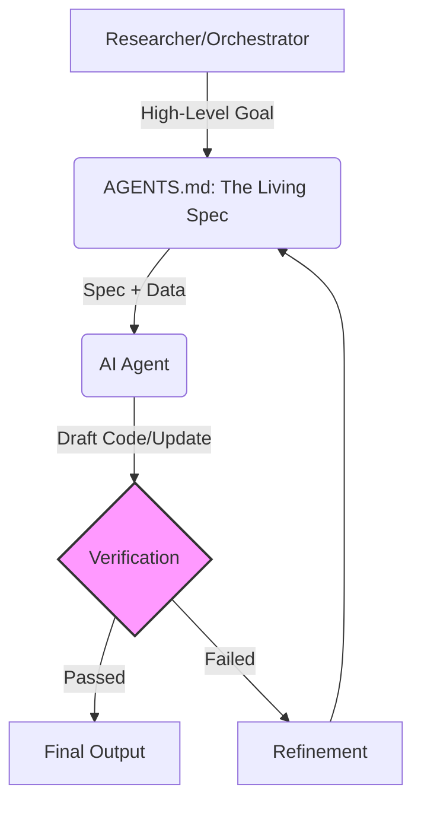

::::::::::::::::::::::::::::::::::::::: objectives

## Objectives

- Compare CLI and browser-based AI tools.
- Create a 'Living Spec' (AGENTS.md) to guide an agent.
- Explain the shift from writer to orchestrator.

::::::::::::::::::::::::::::::::::::::::::::::::::

:::::::::::::::::::::::::::::::::::::::: questions

- Why use a CLI for AI instead of a browser?
- What is the AGENTS.md file?

::::::::::::::::::::::::::::::::::::::::::::::::::

::::::::::::::::::::::::::::::::::::::::: instructor

## Setup check

Ask all learners to run:

```bash
gemini --version
```

If it returns a version number, they are ready. If the command is not found, they need to complete the install and run `gemini auth login` before continuing.

::::::::::::::::::::::::::::::::::::::::::::::::::

## Why CLI matters for research

Most researchers use chat-based AI in a browser. These tools are good for brainstorming but run in an isolated sandbox. They cannot see your files, run your code, or understand your project structure without manual uploads.

A CLI agent runs in your terminal and has access to three things a browser tool does not.

**Your files and data.** The agent can read your actual datasets, inspect your directory structure, and write scripts directly to disk. You are not copying and pasting between a chat window and a code editor. The agent works in your project the way a collaborator sitting at your machine would.

**Your installed tools.** Your machine probably has domain-specific software on it: geospatial tools like GDAL, bioinformatics pipelines, R packages, custom scripts, institutional data connectors. A browser AI has no idea these exist. A CLI agent can call them directly, pass output between them, and build on what you already have installed.

**An iterative loop.** When a script fails, the agent sees the error output in the terminal and can try again. You are not copying stack traces back into a chat window. The feedback loop is tight and stays in one place.

::::::::::::::::::::::::::::::::::::::::: caution

## Data privacy and institutional context

The University of California and many other campuses have enterprise agreements with AI vendors like OpenAI and Google. These agreements usually state that your data will not be used to train public models.

However, CLI or API access under these agreements is not always documented. Campus IT often needs to provision this access, and terms can vary. Verify with your institution whether your license covers both web interfaces and CLI/API access.

**Warning:** Personal accounts may allow CLI/API usage but often lack the privacy protections of institutional licenses. Consult your campus IT policy before using AI tools with sensitive data.

**Looking ahead:** If your research requires absolute privacy, these skills transfer to open LLMs (like Gemma or Llama) run locally via Ollama.

::::::::::::::::::::::::::::::::::::::::::::::::::

## Shift from writer to orchestrator

Traditional programming requires you to remember the syntax and logic of a script. **Spec-Driven Research Orchestration** offloads syntax generation to the AI, letting you focus on the high-level logic and the **Living Spec**.

<!-- TODO: Replace this diagram. Current version is a placeholder.
     Needs redesign to reflect updated workflow (GEMINI.md, plan-before-act,
     approval gate). Design and final spec coming later. -->


```mermaid
graph TD
    A[Researcher/Orchestrator] -->|High-Level Goal| B(AGENTS.md: The Living Spec)
    B -->|Spec + Data| C(AI Agent)
    C -->|Draft Code/Update| D{Verification}
    D -->|Passed| E[Final Output]
    D -->|Failed| F[Refinement]
    F --> B
    style D fill:#f9f,stroke:#333,stroke-width:2px
```

::::::::::::::::::::::::::::::::::::::::: instructor

## Discussion prompt
Ask learners: "Have you ever used ChatGPT to write code that looked correct but failed when you ran it?"
This is a good time to introduce the concept of orchestration. The goal is not just to "fix" code, but to ensure the AI's *intent* (the spec) is correct.

::::::::::::::::::::::::::::::::::::::::::::::::::

This introduces a new challenge: **verification load**. You must coordinate and validate the agent's actions against your requirements.

::::::::::::::::::::::::::::::::::::::::: callout

## Managing cognitive load

It is common to feel "out of the loop" when the AI generates many lines of code quickly. To manage this, focus on anchoring your understanding. Read the comments the AI generates and test small pieces of code frequently. If a block of logic is confusing, ask the AI to explain it before moving on.

::::::::::::::::::::::::::::::::::::::::::::::::::

## File system access

Unlike browser tools, the Gemini CLI has access to your working environment. It can read project context from the directory structure and modify files. Instead of copying and pasting code, the agent writes scripts to your disk and can iterate based on terminal errors.

::::::::::::::::::::::::::::::::::::::::: caution

## Security responsibility

Giving an AI agent access to your filesystem is a security responsibility. A buggy or misconfigured agent could delete files or access sensitive data, such as passwords.

Always consider that your tools can have unintended consequences. Ensure files are backed up or under version control (like Git) so you can revert unwanted changes.

::::::::::::::::::::::::::::::::::::::::::::::::::

### Long context

Like humans, we only have a certain amount of working memory and LLMs operate in similar fashion. This is called the **context window** in LLM tools. Models like Gemini 2.5 have a long context window of 1 million to 2 million tokens. You can provide the AI with your entire project folder—scripts, documentation, and small datasets—at once.

This allows you to describe the desired state of your project, and the agent coordinates changes across multiple files. In a research context, this is declarative programming with AI agents.

::::::::::::::::::::::::::::::::::::::::: callout

TODO: change this some caveat about degredation of the llm as you load more to the context it could degrade. This is called context poisioning. Just be mindful that managing this context is an important part of the workflow you are building. Take out these heuristics below.  context window is important. 

::::::::::::::::::::::::::::::::::::::::::::::::::

## Let's make sure this works

Open a terminal window and type `gemini --help` and you should see something like: 

```bash
Usage: gemini [options] [command]

Gemini CLI - Defaults to interactive mode. Use -p/--prompt for non-interactive (headless) mode.

Commands:
  gemini [query..]             Launch Gemini CLI                                                                                                      [default]
  gemini mcp                   Manage MCP servers
  gemini extensions <command>  Manage Gemini CLI extensions.                                                                               [aliases: extension]
  gemini skills <command>      Manage agent skills.                                                                                            [aliases: skill]
  gemini hooks <command>       Manage Gemini CLI hooks.                                                                                         [aliases: hook]
...
```

## Starting a Gemini CLI session

Navigate to your project folder in the terminal, then run `gemini` with no arguments to open an interactive session:

```bash
cd path/to/your/project
gemini
```

The CLI loads your `GEMINI.md` automatically if one exists, then displays a prompt where you type requests directly. To exit at any time, type `exit` or press Ctrl+D.

::::::::::::::::::::::::::::::::::::::::: callout

## Working directory matters

Always start the Gemini CLI from inside your project folder. The agent uses the current directory to find your files and spec. Starting from the wrong folder — such as your home directory — is one of the most common sources of confusion in a workshop.

::::::::::::::::::::::::::::::::::::::::::::::::::


## Challenge: Your first AI CLI command

Navigate to your project folder and start a session:

```bash
cd /path/to/project/directory ##need to scaffold 
gemini -p "Tell me what operating system I am currently using and list the files in this directory."
```

Compare the output to what you see when you run `ls` (or `dir` on Windows). Did the AI accurately describe your environment?

## Example output

The AI should return a response similar to:

"You are currently using macOS (Darwin). The files in this directory are: 
- index.md
- config.yaml
- episodes/
- data/
..."

Notice that gemini can 'see' your files and understands what environment you are working in. 

We have a project folder that we want to start a project in, let's initialize it as a gemini project and see what that does. 


### Initialize your project

The Gemini CLI includes an `init` command that creates a `GEMINI.md` template in your working directory:

```bash
gemini
```
You are now in gemini itself. Now let type the slash key and see the slash commands that are available to us, page thru and see the full list. Now, if you noticed the `/init` command, this is the one that will initialize our project in gemini. Let's run it

```bash
/init
```

Notice that it does a bunch of stuff and inspects your file folders. After it finishes let's see what new files have been created. You can do this inside gemini by: 

```bash
!ls
```

This shows the files that are created. You should see a file named `GEMINI.md`. Let's look inside it using the `cat` command with `!`:

```bash
!cat GEMINI.md
```

Here is what Gemini generated for a fresh empty project folder:

```markdown
# Project Context: vibe-coding-lesson

## Directory Overview

The `/Users/geno/Desktop/vibe-coding-lesson` directory appears to be an empty
project directory. It currently contains only this `GEMINI.md` file, which
serves as an index and context provider for the project.

## Key Files

*   **`GEMINI.md`**: This file contains project-specific context, documentation,
    and instructional information for AI agents and developers. It is intended to
    be updated as the project evolves.

## Usage

This directory is intended to be a workspace for the 'vibe-coding-lesson'
project. As it is currently empty, it is ready for initialization or the
addition of new files and code. Future usage will depend on the specific goals
of the 'vibe-coding-lesson' project.

---
*Last analyzed on: March 25, 2026*
```

A few things to notice. Gemini scanned the directory and described what it found. Because the folder was empty, it does not have much to say yet. Once you add data files, scripts, and documentation, running `/init` again will produce a richer spec that reflects your actual project. This is also something you will want to edit by hand — add your goals, constraints, and any rules you want the agent to follow.

## The Living Spec

To get the most out of a CLI agent, provide it with persistent context about your project. This acts as a "Living Spec"—a set of rules and goals the agent must follow across every session.

Every major CLI tool has its own **native** spec file that it loads automatically when you start a session:

| Tool | Native spec file | Auto-loaded? |
|---|---|---|
| Gemini CLI | `GEMINI.md` | Yes |
| Claude Code | `CLAUDE.md` | Yes |
| OpenAI Codex | `AGENTS.md` | Yes |
| Cursor | `.cursorrules` | Yes |

You can also use a **portable** spec file—`AGENTS.md` is a common convention—that you explicitly reference in any prompt: `"Read AGENTS.md and then..."`. It is not auto-loaded by any single tool, but it travels with your project if you switch tools.

::::::::::::::::::::::::::::::::::::::::: callout

## Which approach should you use?

- **Stick with one tool?** Use the native file (`GEMINI.md` here) for a smoother experience — you never have to mention it in your prompts.
- **Move between tools?** Keep a portable `AGENTS.md` and reference it explicitly. The spec stays the same; only the tool changes.

For this lesson we use `GEMINI.md` as the native file. The same content and concepts apply if you switch to any other tool.

::::::::::::::::::::::::::::::::::::::::::::::::::

### Initialize your project

The Gemini CLI includes an `init` command that creates a `GEMINI.md` template in your working directory:

```bash
gemini init
```

This generates a starter file with placeholder sections for you to fill in. Open it in any text editor to customize it for your project.

### What to include in your spec file

Use this file to define:

- **Current Goal**: What you are working on right now.
- **Rules of the Road**: Technical constraints (e.g., "Always use `pandas` for dataframes").
- **Verification Gates**: How you will confirm the code is correct.

::::::::::::::::::::::::::::::::::::::::: challenge

## Challenge: Initialize and customize your spec file

In your project directory, run `gemini init` to create a `GEMINI.md` file. Then edit it to define one "Hard Constraint" (something the AI *must* do) and one "Success Metric" (how you know it's done).

:::::::::::::::::::::::::::::::::::::::: solution

## Example spec file

<!-- TODO: Once model config mechanism is confirmed, add a 'model: gemini-2.5-flash-lite'
     line (or equivalent) to this example so learners see model pinning as a
     standard part of the spec from the start. -->

```markdown
# Project: Arctic Sea Ice Analysis

## Goal
To analyze trends in sea ice extent from 1980-2020.

## Rules of the Road
- **Hard Constraint**: Only use the `xarray` library for spatial data processing.
- **Success Metric**: All final plots must include a valid DOI reference for the data source.

## Conventions
- Use snake_case for variable names.
- Save all plots to the `figures/` directory.
```

::::::::::::::::::::::::::::::::::::::::::::::::::

::::::::::::::::::::::::::::::::::::::::::::::::::

:::::::::::::::::::::::::::::::::::::::: keypoints

- CLI agents coordinate actions across multiple files.
- Run `gemini init` to create a `GEMINI.md` Living Spec that reduces "context drift."
- A portable `AGENTS.md` lets the same spec travel across different AI tools.
- Research orchestration shifts focus from writing syntax to validating intent.

::::::::::::::::::::::::::::::::::::::::::::::::::
