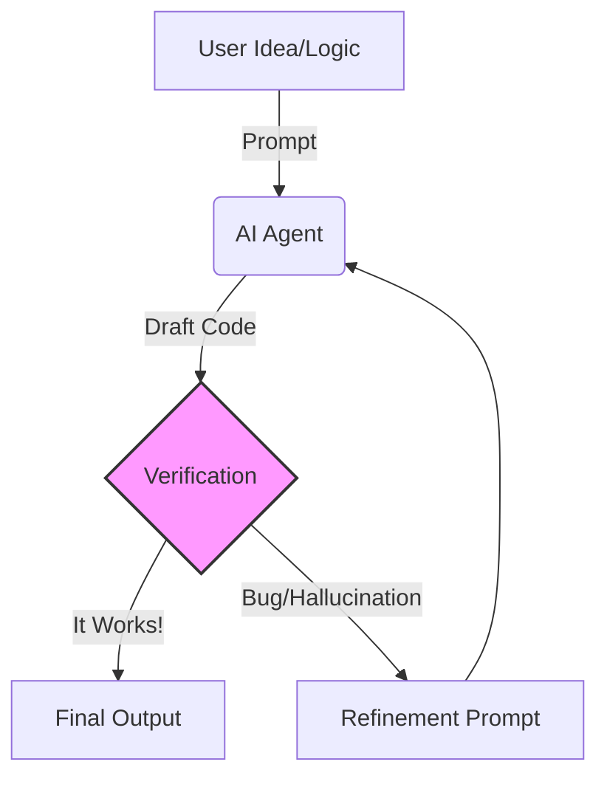

::::::::::::::::::::::::::::::::::::::: objectives

## Objectives

- Compare CLI and Browser-based AI tools.
- Create a project context file.

::::::::::::::::::::::::::::::::::::::::::::::::::

:::::::::::::::::::::::::::::::::::::::: questions

- Why use a CLI for AI instead of a browser?
- What is the GEMINI.md file?

::::::::::::::::::::::::::::::::::::::::::::::::::

::::::::::::::::::::::::::::::::::::::::: instructor

## Setup Check
Before starting, ensure all learners have their `GEMINI_API_KEY` exported in their shell.
**Quick Test:** Ask them to run `echo $GEMINI_API_KEY`. If it returns a blank line, they need to run the export command again.

::::::::::::::::::::::::::::::::::::::::::::::::::

## Why CLI Matters for Research

Most researchers are familiar with chat-based AI in a browser. However, for coding and data analysis, CLI-based tools offer significant advantages.

| Feature | Browser-Based AI | CLI-Based AI |
| :--- | :--- | :--- |
| **Interface** | Conversation in browser | Runs in your terminal |
| **File Access** | Manual copy-paste/upload | Reads/writes files directly |
| **Context** | Limited context window | Larger persistent memory |
| **Execution** | You run the code | AI runs code and sees results |
| **Autonomy** | One response at a time | Autonomous multi-step execution |

::::::::::::::::::::::::::::::::::::::::: callout

## Why Gemini? (UC & UCLA Context)

We use the Gemini CLI for this lesson because the **University of California (UC)** system, including **UCLA**, has a Google Workspace agreement that offers significant benefits for researchers:

1.  **Data Privacy**: When using "Gemini for Google Workspace" (the enterprise version), your data is **not** used to train the public models. Your research data stays yours.
2.  **Access**: It is integrated into the tools we already use (Drive, Docs, etc.).
3.  **Cost**: It is often included in institutional licenses, avoiding personal subscription fees.

*Note: Always verify with your specific campus IT policy before uploading sensitive or PII (Personally Identifiable Information) data to any AI tool.*

**Looking Ahead: Open Models**
While we use Gemini today, the skills you learn transfer directly to "Open LLMs" (like **Gemma** or **Llama**). These can be run locally on your own laptop (using tools like **Ollama**), offering the ultimate privacy: no data ever leaves your machine.

::::::::::::::::::::::::::::::::::::::::::::::::::

## The Mental Shift: From Writer to Editor

Traditional programming requires you to hold the entire syntax and logic of a script in your working memory. Vibe coding offloads the *syntax* generation to the AI, freeing up your cognitive resources for higher-level tasks.



::::::::::::::::::::::::::::::::::::::::: instructor

## Discussion Prompt
Ask learners: "Have you ever used ChatGPT to write code that *looked* correct but failed when you ran it?"
This is a great moment to normalize the "Verification Load" concept. The goal is to shift their mindset from "trusting the machine" to "managing the machine."

::::::::::::::::::::::::::::::::::::::::::::::::::

However, this introduces a new challenge: **Verification Load**. You must be vigilant in reading and testing code you didn't write.

::::::::::::::::::::::::::::::::::::::::: callout

## Managing Cognitive Load

It is common to feel "out of the loop" when the AI generates 50 lines of code in seconds. To manage this:

1.  **Read the Comments**: Ask the AI to comment its code heavily.
2.  **Test Frequently**: Run small pieces of code to "anchor" your understanding.
3.  **Ask "Why?"**: If a piece of code looks complex, ask the AI to explain it to you.

::::::::::::::::::::::::::::::::::::::::::::::::::

## The Power of the File System

CLI tools like the Gemini CLI can:

1. **Read** any file in your project directory.
2. **Create** new scripts, data files, or configurations.
3. **Iterate** automatically based on terminal errors.
4. **Maintain** context across long sessions.

::::::::::::::::::::::::::::::::::::::::: challenge

## Challenge: Your First AI CLI Command

Let's verify the tool is working and see how it interacts with your system. In your terminal, run the following command:

```bash
gemini "Tell me what operating system I am currently using and list the files in this directory."
```

Compare the output to what you see when you run `ls` (or `dir` on Windows) and `uname -a`. Did the AI accurately describe your environment?

:::::::::::::::::::::::::::::::::::::::: solution

## Example Output

The AI should return a response similar to:

"You are currently using macOS (Darwin). The files in this directory are: 
- index.md
- config.yaml
- episodes/
- data/
..."

*Note: The AI's exact wording will vary, but it should correctly identify your OS and the files you see in your folder.*

::::::::::::::::::::::::::::::::::::::::::::::::::

::::::::::::::::::::::::::::::::::::::::::::::::::

## Project Context: GEMINI.md and CONTEXT.md

To get the most out of a CLI agent, you should provide it with persistent context about your project. Different tools look for specific filenames to automatically load this context:

*   **Gemini CLI**: Looks for `GEMINI.md`
*   **Claude Code**: Looks for `CLAUDE.md`
*   **Cursor**: Looks for `.cursorrules`

### The Emerging Standard: CONTEXT.md

While these tools require specific filenames, an **emerging standard** is to maintain a single master file named `CONTEXT.md`.

**Why use CONTEXT.md?**
1.  **Tool Agnosticism**: It acts as a "Source of Truth." You can link it to tool-specific files (e.g., `cp CONTEXT.md GEMINI.md`) so you don't have to duplicate work if you switch tools.
2.  **Web-Based AI**: If you use ChatGPT or Claude in the browser, they cannot read your files. You can quickly copy the contents of `CONTEXT.md` into the chat to "prime" the session with your project's rules.

For this specific lesson, we will use `GEMINI.md` directly so the CLI works immediately.

### What to Include

By creating this file in your project root, you can define:

- Project goals.
- File structure overview.
- Tech stack (libraries/dependencies).
- Coding conventions.
- Specific constraints (e.g., "always use type hints").

::::::::::::::::::::::::::::::::::::::::: challenge

## Challenge: Create your GEMINI.md

In your project directory, create a file named `GEMINI.md` and add a brief description of a research project you are working on. Include at least two libraries you use and one coding convention (e.g., "Use snake_case for functions").

:::::::::::::::::::::::::::::::::::::::: solution

## Example GEMINI.md

```markdown
# Project: Arctic Sea Ice Analysis

## Goal
To analyze trends in sea ice extent using satellite data from 1980-2020.

## Tech Stack
- Python 3.9
- Libraries: xarray, pandas, matplotlib, cartopy

## Conventions
- Use snake_case for variable names.
- Include docstrings for all functions.
- Save all plots to the `figures/` directory.
```

::::::::::::::::::::::::::::::::::::::::::::::::::

::::::::::::::::::::::::::::::::::::::::::::::::::

:::::::::::::::::::::::::::::::::::::::: keypoints

## Key Points

- CLI tools can edit files directly.
- Persistent context in GEMINI.md improves AI performance.

::::::::::::::::::::::::::::::::::::::::::::::::::
