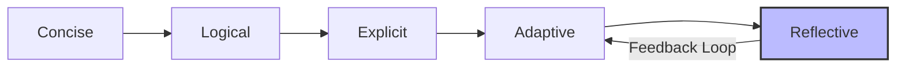

::::::::::::::::::::::::::::::::::::::: objectives

## Objectives

- Apply the CLEAR framework.
- Identify sneaky AI behaviors.
- Use introspection to refine code.

::::::::::::::::::::::::::::::::::::::::::::::::::

:::::::::::::::::::::::::::::::::::::::: questions

- How do I write effective prompts?
- What are common AI failures?
- How can I make the AI fix its own mistakes?

::::::::::::::::::::::::::::::::::::::::::::::::::

## The Five Principles of Effective Prompting

Writing effective prompts is less about "hacking" the AI and more about clear technical communication. To get the best results, start by being **Specific**. Include constraints, relevant filenames, and a clear description of your expected output. Vague requests lead to generic answers, while precise instructions yield usable code.

Next, provide **Context**. Explain *why* you need the code and what you already have (e.g., "I am processing a CSV file with these columns..."). This helps the AI understand the broader goal. Be sure to **Specify Outputs** clearly—tell the AI exactly where to save files or how to format tables.

Finally, treat prompting as an **Iterative** process. Start with a simple request and add complexity in follow-up prompts. Throughout this process, include **Validation** steps by explicitly asking the AI to "verify" or "test" its own work.

::::::::::::::::::::::::::::::::::::::::: callout

## The CO-STAR Framework

While CLEAR (below) helps with the flow of a conversation, **CO-STAR** is an excellent framework for structuring your initial, complex research prompts:

*   **C: Context** - Provide background (e.g., "I am a biologist analyzing RNA-seq data").
*   **O: Objective** - Define the specific task ("Write a script to normalize these counts").
*   **S: Style** - Specify the coding style ("Use the Tidyverse style guide in R").
*   **T: Tone** - Set the "personality" ("Be concise and prioritize readable code").
*   **A: Audience** - Who is this for? ("For a graduate student who knows R but not bioinformatics").
*   **R: Response** - Define the format ("A single R script with comments and a plot output").

::::::::::::::::::::::::::::::::::::::::::::::::::

::::::::::::::::::::::::::::::::::::::::: callout

## Concrete Example: From Bad to Good

| Aspect | Bad Prompt | Good Prompt |
| :--- | :--- | :--- |
| **Vague vs Specific** | "Clean this data." | "In `data.csv`, remove rows with missing values in the 'age' column and save as `clean_data.csv`." |
| **No Context vs Context** | "Write a plot script." | "I am building a report for a climate study. Write a Python script using seaborn to create a line plot of 'temp' over 'year' from `results.csv`." |
| **Silent vs Validated** | "Run a t-test." | "Perform a paired t-test between 'pre' and 'post' columns. Print the t-statistic, p-value, and an interpretation of the result at alpha=0.05." |

::::::::::::::::::::::::::::::::::::::::::::::::::

::::::::::::::::::::::::::::::::::::::::: instructor

## Teaching Tip: Visual Aids
Write **CLEAR** vertically on the whiteboard or shared document. As you explain each letter, add the keyword (Concise, Logical, Explicit, Adaptive, Reflective). This visual anchor helps retention.

::::::::::::::::::::::::::::::::::::::::::::::::::

## The CLEAR Framework

The CLEAR framework, developed by [Leo Lo](https://doi.org/10.1016/j.acalib.2023.102720), provides a structured approach to prompt engineering:



Effective prompts are **Concise** and **Logical**, prioritizing important information and following a coherent sequence of steps. They are also **Explicit**, clearly specifying the scope, persona, and desired tone of the output. When the AI gets stuck or produces poor results, you must be **Adaptive**, rephrasing or splitting tasks to guide it back on track. Finally, be **Reflective**—always evaluate the output critically and verify facts using lateral reading, rather than blindly trusting the generated response.

## The Missing Ingredient: Introspection

The CLEAR framework guides *your* input, but you can also force the AI to critique its *own* output. This is often called "Self-Correction."

::::::::::::::::::::::::::::::::::::::::: instructor

## The "Superpower" Concept
Emphasize this section. Most learners treat the AI output as final. The idea that they can ask the AI to "fix its own work" is often a lightbulb moment. 
*Analogy:* It's like asking a student, "Are you sure you checked your work?"—often they find their own mistakes just by being asked.

::::::::::::::::::::::::::::::::::::::::::::::::::

**The Principle:** AI models are often better at *verifying* code than *writing* it.

**How to use it:**
Never accept the first draft. Always follow up with an "Introspection Prompt":

*   "Review the code you just wrote. Are there any edge cases or security vulnerabilities?"
*   "Did you hardcode any file paths?"
*   "Critique your own implementation. Is there a more efficient way?"

### A New Frontier: Reasoning Models

As of 2025, a new category of models called **Reasoning Models** (such as **OpenAI o1/o3**, **DeepSeek-R1**, or **Gemini 2.0 Thinking**) has emerged. Unlike standard "fast" models that predict the next word immediately, these models are trained to perform **Chain of Thought** reasoning before they answer.

**When to use them:**

- **Standard Models (e.g., Gemini Flash):** Best for quick formatting, simple scripts, and brainstorming.
- **Reasoning Models:** Best for complex logic, debugging hard errors, or writing scientific formulas where accuracy is more important than speed.

When using a reasoning model, you often don't need to ask for "Introspection"—they are already doing it "under the hood" before they show you the code!

## Watch Out for "Sneaky" AI

AI agents are designed to be helpful, which can sometimes lead them to take shortcuts to appear successful. 

### Advanced Failure Modes

*   **Determinism Collapse:** Small variations in prompts or model updates can lead to different outputs for the same task. In research, this is a reproducibility nightmare. 
    *   *Fix:* Use `temperature=0` (if your tool allows) and log your model versions/prompts.
*   **Over-correction Loops:** If an agent is allowed to write and run its own tests, it might "fix" the test to match its buggy code rather than fixing the code to match your requirements.
    *   *Fix:* Always author your "Ground Truth" requirements or key tests yourself.
*   **Synthetic Data Substitution:** The AI silently generates fake data if it can't find the real file.
*   **Silent Failure:** The AI uses `try/except` blocks that hide errors from you.

:::::::::::::::::::::::::::::::::::::: discussion

## How to Catch It?

Have you ever seen an AI make a confident mistake? In your own research, what "tells" might indicate the AI is hallucinating?

**Common Strategies:**

*   Always ask: "Show me the first 10 rows of the data you loaded."
*   Demand proof: "How did you calculate that p-value? Show the intermediate steps."
*   Check the file sizes of outputs: Is the "cleaned" file 0 bytes?

:::::::::::::::::::::::::::::::::::::::::::::::::

::::::::::::::::::::::::::::::::::::::::: challenge

## Challenge: The Prompt Refinement Loop

Let's practice the **CLEAR** framework. We want to visualize the relationship between "Date" and "Score" in our (theoretical) dataset.

1.  **Run a vague command:**
    `gemini "Create a plot of the data I just made."`
    *Observe: Does it work? Is the plot useful? Where did it save it?*

2.  **Refine the command:**
    Write a new prompt that applies **Context** (what the data is), **Specificity** (scatterplot with regression line), and **Output** (save as `fig/trend_analysis.png`).

:::::::::::::::::::::::::::::::::::::::: solution

## Example Refined Prompt

```bash
gemini "Using the 'master_dataset.csv' file, create a Python script to generate a scatterplot of 'date' vs 'score'. Add a linear regression trendline. Label the axes clearly. Save the final plot to a file named 'fig/trend_analysis.png' (create the directory if it doesn't exist)."
```

### Reflection

*   How much longer was your "Good" prompt compared to your "Bad" one?
*   Did defining the output filename save you from hunting for the file later?
*   This extra "typing time" saves you "debugging time."

::::::::::::::::::::::::::::::::::::::::::::::::::

::::::::::::::::::::::::::::::::::::::::::::::::::

:::::::::::::::::::::::::::::::::::::::: keypoints

## Key Points

- Be specific and provide context.
- Always validate AI outputs.
- Introspection (Self-Correction) improves code quality.

::::::::::::::::::::::::::::::::::::::::::::::::::
