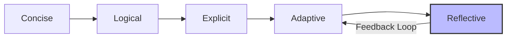

::::::::::::::::::::::::::::::::::::::: objectives

## Objectives

- Apply the CLEAR framework.
- Identify common AI failures.
- Use introspection to refine code.

::::::::::::::::::::::::::::::::::::::::::::::::::

:::::::::::::::::::::::::::::::::::::::: questions

- How do I write effective prompts?
- What are common AI failures?
- How can I make the AI fix its own mistakes?

::::::::::::::::::::::::::::::::::::::::::::::::::

## Five principles of effective prompting

Effective prompting is clear technical communication. To get the best results, start by being specific. Include constraints, filenames, and a description of your expected output. Vague requests lead to generic answers, while precise instructions result in usable code.

Provide context. Explain why you need the code and what data you have (e.g., "I am processing a CSV file with these columns..."). This helps the AI understand the goal. Specify outputs clearly—tell the AI where to save files or how to format tables.

Treat prompting as an iterative process. Start with a simple request and add complexity in follow-up prompts. Include validation steps by asking the AI to verify or test its own work.

::::::::::::::::::::::::::::::::::::::::: callout

## The CO-STAR framework

While CLEAR helps with conversation flow, CO-STAR structures complex research prompts:

*   **Context**: Provide background (e.g., "I am a biologist analyzing RNA-seq data").
*   **Objective**: Define the specific task ("Write a script to normalize these counts").
*   **Style**: Specify the coding style ("Use the Tidyverse style guide in R").
*   **Tone**: Set the personality ("Be concise and prioritize readable code").
*   **Audience**: Who is this for? ("For a graduate student who knows R but not bioinformatics").
*   **Response**: Define the format ("A single R script with comments and a plot output").

::::::::::::::::::::::::::::::::::::::::::::::::::

::::::::::::::::::::::::::::::::::::::::: callout

## Concrete example: From bad to good

| Aspect | Bad prompt | Good prompt |
| :--- | :--- | :--- |
| Vague vs specific | "Clean this data." | "In `data.csv`, remove rows with missing values in the 'age' column and save as `clean_data.csv`." |
| No context vs context | "Write a plot script." | "I am building a report for a climate study. Write a Python script using seaborn to create a line plot of 'temp' over 'year' from `results.csv`." |
| Silent vs validated | "Run a t-test." | "Perform a paired t-test between 'pre' and 'post' columns. Print the t-statistic, p-value, and an interpretation of the result at alpha=0.05." |

::::::::::::::::::::::::::::::::::::::::::::::::::

::::::::::::::::::::::::::::::::::::::::: instructor

## Teaching tip: Visual aids
Write CLEAR vertically on a whiteboard. As you explain each letter, add the keyword (Concise, Logical, Explicit, Adaptive, Reflective). This helps students remember the framework.

::::::::::::::::::::::::::::::::::::::::::::::::::

## The CLEAR framework

The CLEAR framework, developed by [Leo Lo](https://doi.org/10.1016/j.acalib.2023.102720), provides a structured approach to prompt engineering:



Effective prompts are concise and logical, prioritizing important information and following a sequence of steps. They are also explicit, specifying the scope, persona, and tone of the output. When the AI produces poor results, be adaptive by rephrasing or splitting tasks. Finally, be reflective—evaluate the output and verify facts using other sources rather than trusting the response.

## Introspection

The CLEAR framework guides your input, but you can also force the AI to critique its own output. This is often called self-correction.

::::::::::::::::::::::::::::::::::::::::: instructor

## The introspection concept
Emphasize this section. Most learners treat AI output as final. The idea that they can ask the AI to fix its own work is often a new concept. It is like asking a student, "Are you sure you checked your work?"—they often find their own mistakes when asked.

::::::::::::::::::::::::::::::::::::::::::::::::::

AI models are often better at verifying code than writing it. Never accept the first draft. Follow up with an introspection prompt:

*   "Review the code you just wrote. Are there any edge cases or security vulnerabilities?"
*   "Did you hardcode any file paths?"
*   "Critique your own implementation. Is there a more efficient way?"

### Reasoning models

As of 2025, reasoning models (such as OpenAI o1/o3, DeepSeek-R1, or Gemini 2.0 Thinking) have emerged. These models perform chain of thought reasoning before they answer.

**When to use them:**

- **Standard models (e.g., Gemini Flash):** Best for quick formatting, simple scripts, and brainstorming.
- **Reasoning models:** Best for complex logic, debugging hard errors, or writing scientific formulas where accuracy is important.

When using a reasoning model, you often do not need to ask for introspection—they do it before showing the code.

## AI failures

AI agents are designed to be helpful, which can lead them to take shortcuts.

### Common failure modes

*   **Determinism collapse:** Small variations in prompts or model updates can lead to different outputs for the same task, which affects reproducibility. 
    *   *Fix:* Use `temperature=0` (if available) and log your model versions and prompts.
*   **Over-correction loops:** If an agent runs its own tests, it might fix the test to match its buggy code.
    *   *Fix:* Write your own requirements and key tests.
*   **Synthetic data substitution:** The AI may generate fake data if it cannot find the real file.
*   **Silent failure:** The AI uses `try/except` blocks that hide errors.

:::::::::::::::::::::::::::::::::::::: discussion

## How to catch failures

Have you seen an AI make a confident mistake? In your research, what signs indicate the AI is hallucinating?

**Common strategies:**

*   Always ask: "Show me the first 10 rows of the data you loaded."
*   Demand proof: "How did you calculate that p-value? Show the intermediate steps."
*   Check file sizes: Is the cleaned file 0 bytes?

:::::::::::::::::::::::::::::::::::::::::::::::::

::::::::::::::::::::::::::::::::::::::::: challenge

## Challenge: The prompt refinement loop

Practice the CLEAR framework to visualize the relationship between "Date" and "Score" in a dataset.

1.  **Run a vague command:**
    `gemini "Create a plot of the data I just made."`
    *Observe: Does it work? Is the plot useful? Where did it save it?*

2.  **Refine the command:**
    Write a new prompt that applies context (what the data is), specificity (scatterplot with regression line), and output instructions (save as `fig/trend_analysis.png`).

:::::::::::::::::::::::::::::::::::::::: solution

## Example refined prompt

```bash
gemini "Using the 'master_dataset.csv' file, create a Python script to generate a scatterplot of 'date' vs 'score'. Add a linear regression trendline. Label the axes clearly. Save the final plot to a file named 'fig/trend_analysis.png' (create the directory if it doesn't exist)."
```

### Reflection

*   How much longer was your refined prompt compared to your first one?
*   Did defining the output filename save you from searching for the file?
*   Extra typing time can save debugging time.

::::::::::::::::::::::::::::::::::::::::::::::::::

::::::::::::::::::::::::::::::::::::::::::::::::::

:::::::::::::::::::::::::::::::::::::::::: challenge

## Challenge: The introspection loop

Test the AI as a verifier principle. Ask the AI to find flaws in its code before you run it.

1.  **Generate a script:** Use a prompt like: `gemini "Write a Python script that reads 'data.csv' and calculates the rolling 7-day average of a 'score' column. Handle missing values."`
2.  **Force introspection:** Once the code is generated, do not run it. Instead, prompt the AI again: `gemini "Review the rolling average script you just wrote. Are there any edge cases (like having fewer than 7 days of data) where this would fail? If so, provide an updated version."`
3.  **Compare:** Did the AI find a mistake in its first draft? Did it add a guard clause like `min_periods=1`?

:::::::::::::::::::::::::::::::::::::::: solution

### Reflection

AI models are often more accurate when asked to critique logic than when asked to generate it. This second pass is part of the editor mindset and reduces manual debugging.

::::::::::::::::::::::::::::::::::::::::::::::::::

::::::::::::::::::::::::::::::::::::::::::::::::::

::::::::::::::::::::::::::::::::::::::: keypoints

- Be specific and provide context.
- Always validate AI outputs.
- Introspection improves code quality.

::::::::::::::::::::::::::::::::::::::::::::::::::
